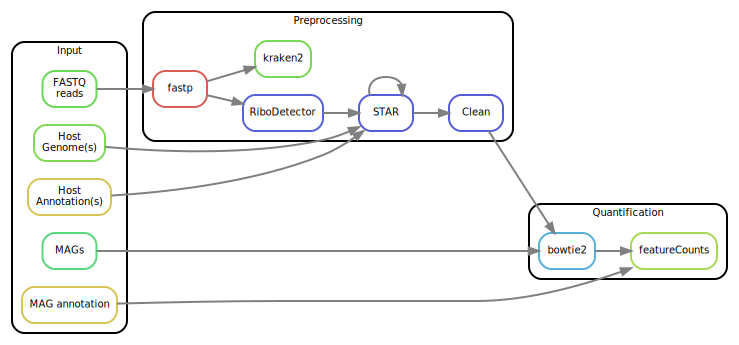

# Snakemake workflow: `Bioinfo_Macro_Microbial_Metatranscriptomics`

[](https://snakemake.github.io)
[](https://github.com/3d-omics/Bioinfo_Macro_Microbial_Metatranscriptomics/actions?query=branch%3Amain+workflow%3ATests)


A Snakemake workflow for `Bioinfo_Macro_Microbial_Metatranscriptomics`:
- Preprocessing:
  - Trim reads with `fastp`
  - Remove rRNAs with `ribodetector`
  - Remove host RNA with `STAR`
  - Screen your reads with `kraken2`
- Quantification:
  - Map reads to a MAG catalogue with `bowtie2`
  - Get count tables with `CoverM`
- Report
  - Get a gazillion of reports with `samtools`, `fastqc` and `multiqc`




## Usage

1. Make sure you have `conda`, `mamba` and `snakemake` installed.
    ```bash
    conda --version
    mamba --version
    snakemake --version
    ```

2. Clone this git repository and get it
    ```bash
    git clone https://github.com/3d-omics/Bioinfo_Macro_Microbial_Metatranscriptomics
    cd Bioinfo_Macro_Microbial_Metatranscriptomics
    ```

3. Test your installation by running the pipeline with test data. It will download all the necessary software through conda / mamba. It should take less than five minutes.
    ```bash
    ./run
    ```

4. Run it with your own data:

     1. Edit `config/samples.tsv` and add your sample names, a library identifier in case you have more than one file per sample, their paths and adapters used. If no adapters are specified, the pipeline assumes that they are the current Nextera ones:  `AGATCGGAAGAGCACACGTCTGAACTCCAGTCA` and `AGATCGGAAGAGCGTCGTGTAGGGAAAGAGTGT` for forward and reverse, respectively.

        ```tsv
        sample_id	library_id	forward_filename	reverse_filename	forward_adapter	reverse_adapter
        GBRF1	1	resources/reads_mixed/GBRF1.1_1.fq.gz	resources/reads_mixed/GBRF1.1_2.fq.gz
        # GBRF2	1	resources/reads_mixed/GBRF2.1_1.fq.gz	resources/reads_mixed/GBRF2.1_2.fq.gz
        # GBRF3	1	resources/reads_mixed/GBRF3.1_1.fq.gz	resources/reads_mixed/GBRF3.1_2.fq.gz
        GBRM1	1	resources/reads_mixed/GBRM1.1_1.fq.gz	resources/reads_mixed/GBRM1.1_2.fq.gz
        ```

      2. Edit `config/features.yml` with your reference hosts, mags and external databases. You can have multiple hosts and multiple catalogues. You can even have no host files in case you are analyzing environmental samples.

          ```yaml
          # features.yml: paths and parameters for the features
          ---
          hosts:  # Comment the next lines of no host
              human:
                  genome: resources/reference/chrX_sub.fa.gz
                  gtf: resources/reference/chrX_sub.gtf.gz

          mag_catalogues:
              mag1: resources/mags_mock.fa.gz

          kraken2_databases:  # Comment the next lines if no database
              mock: resources/kraken_mock
          ```

      3. Edit `config/params.yml` with the execution parameters. The defaults are reasonable.

  5. Run the pipeline

      ```bash
      ./run -j8  # locally with 8 cpus
      ./run_slurm  # on a cluster with slurm
      ```


## References

- [`fastp`](https://github.com/OpenGene/fastp)
- [`ribodetector`](https://github.com/hzi-bifo/RiboDetector)
- [`STAR`](https://github.com/alexdobin/STAR)
- [`bowtie2`](https://github.com/BenLangmead/bowtie2)
- [`samtools`](https://github.com/samtools/samtools)
- [`CoverM`](https://github.com/wwood/CoverM)
- [`FastQC`](https://github.com/s-andrews/FastQC)
- [`multiqc`](https://github.com/ewels/MultiQC)
